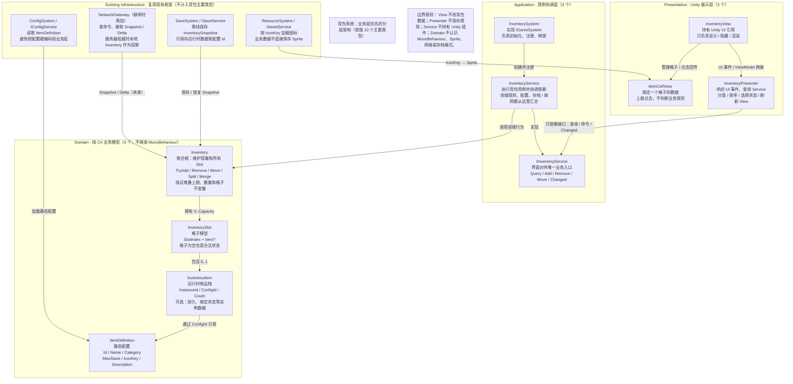
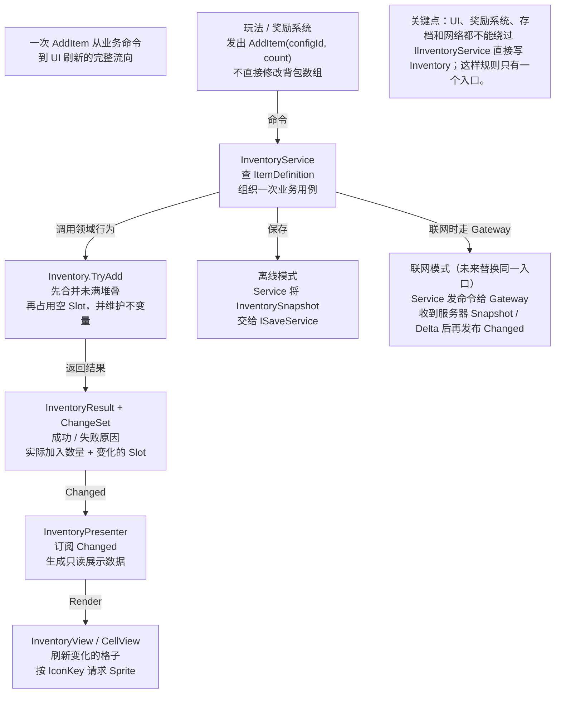

```mermaid
%% Page 1: 背包业务架构
flowchart TB
    n0["背包系统：业务层优先的分层架构（首版 10 个主要类型）"]
    n15["边界原则： View 不改背包数据；Presenter 不保存规则；Service 不持有 Unity 组件；Domain 不认识 MonoBehaviour、Sprite、网络或存档格式。"]
    subgraph g_10["Presentation · Unity 展示层（3 个）"]
        n1["InventoryView<br/>持有 Unity UI 引用<br/>只负责显示 / 隐藏 / 渲染"]
        n2["ItemCellView<br/>绑定一个格子的数据<br/>上报点击，不判断业务规则"]
        n3["InventoryPresenter<br/>响应 UI 事件、查询 Service<br/>分类 / 排序 / 选择状态 / 刷新 View"]
    end
    subgraph g_20["Application · 用例协调层（3 个）"]
        n4["InventorySystem<br/>实现 IGameSystem<br/>负责初始化、注册、释放"]
        n5["IInventoryService<br/>界面对外唯一业务入口<br/>Query / Add / Remove / Move / Changed"]
        n6["InventoryService<br/>执行背包用例并协调依赖<br/>领域规则、配置、存档 / 联网都从这里汇合"]
    end
    subgraph g_30["Domain · 纯 C# 业务模型（4 个，不继承 MonoBehaviour）"]
        n7["ItemDefinition<br/>静态配置<br/>Id / Name / Category<br/>MaxStack / IconKey / Description"]
        n8["InventoryItem<br/>运行时物品栈<br/>InstanceId / ConfigId / Count<br/>可选：耐久、绑定状态等实例数据"]
        n9["InventorySlot<br/>格子模型<br/>SlotIndex + Item?<br/>格子为空也是合法状态"]
        n10["Inventory<br/>聚合根：维护容量和所有 Slot<br/>TryAdd / Remove / Move / Split / Merge<br/>保证堆叠上限、数量和格子不变量"]
    end
    subgraph g_40["Existing Infrastructure · 复用现有框架（不计入背包主要类型）"]
        n11["ConfigSystem / IConfigService<br/>读取 ItemDefinition<br/>避免把配置硬编码到业务层"]
        n12["ResourceSystem / IAssetService<br/>按 IconKey 加载图标<br/>业务数据不直接保存 Sprite"]
        n13["SaveSystem / ISaveService<br/>离线保存 InventorySnapshot<br/>只保存运行时数据和配置 Id"]
        n14["NetworkGateway（联网时再加）<br/>发命令、接收 Snapshot / Delta<br/>服务器权威时本地 Inventory 作为投影"]
    end
    n1 -->|"管理格子 / 点击回传"| n2
    n1 -->|"UI 事件 / ViewModel 刷新"| n3
    n3 -->|"只依赖接口：查询 / 命令 / Changed"| n5
    n4 -->|"创建并注册"| n6
    n6 -->|"实现"| n5
    n6 -->|"调用领域行为"| n10
    n10 -->|"拥有 0..Capacity"| n9
    n9 -->|"包含 0..1"| n8
    n8 -->|"通过 ConfigId 引用"| n7
    n11 -->|"加载静态配置"| n7
    n12 -->|"IconKey → Sprite"| n2
    n13 -->|"保存 / 恢复 Snapshot"| n10
    n14 -->|"Snapshot / Delta（未来）"| n10
```

```mermaid
%% Page 2: 添加物品主流程
flowchart TB
    n0["一次 AddItem 从业务命令到 UI 刷新的完整流向"]
    n1["玩法 / 奖励系统<br/>发出 AddItem(configId, count)<br/>不直接修改背包数组"]
    n2["InventoryService<br/>查 ItemDefinition<br/>组织一次业务用例"]
    n3["Inventory.TryAdd<br/>先合并未满堆叠<br/>再占用空 Slot，并维护不变量"]
    n4["InventoryResult + ChangeSet<br/>成功 / 失败原因<br/>实际加入数量 + 变化的 Slot"]
    n5["InventoryPresenter<br/>订阅 Changed<br/>生成只读展示数据"]
    n6["InventoryView / CellView<br/>刷新变化的格子<br/>按 IconKey 请求 Sprite"]
    n7["离线模式<br/>Service 将 InventorySnapshot<br/>交给 ISaveService"]
    n8["联网模式（未来替换同一入口）<br/>Service 发命令给 Gateway<br/>收到服务器 Snapshot / Delta 后再发布 Changed"]
    n9["关键点：UI、奖励系统、存档和网络都不能绕过 IInventoryService 直接写 Inventory；这样规则只有一个入口。"]
    n1 -->|"命令"| n2
    n2 -->|"调用领域行为"| n3
    n3 -->|"返回结果"| n4
    n4 -->|"Changed"| n5
    n5 -->|"Render"| n6
    n2 -->|"保存"| n7
    n2 -->|"联网时走 Gateway"| n8
```
